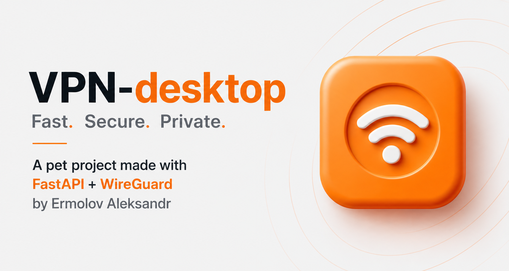

<p align="center">
  
</p>

<p align="center">
  <a href="https://github.com/Sanch0-0/vpn-node-agent/actions"></a>
  
  
  
  
  
</p>

---

## Overview

**vpn-node-agent** is the intermediate layer in the **VPN Desktop** three-tier architecture.

It runs as a `systemd` service on each provisioned Vultr node, receives commands from the **ControlPlane** over a mutually-authenticated TLS channel, and translates them into WireGuard kernel operations in real time.

```
ControlPlane  ──mTLS──▶  Node Agent  ──wg CLI──▶  WireGuard kernel
(FastAPI API)             (this repo)              (DataPlane tunnel)
```

The agent has no database, no user auth, and no business logic — it is intentionally thin. All orchestration lives in the ControlPlane; all tunneling lives in WireGuard. The agent is the glue.

---

## Architecture position

| Layer | Repository | Role |
|---|---|---|
| **ControlPlane** | `vpn-controlplane` | Users, devices, nodes, billing, audit |
| **Node Agent** ← *this repo* | `vpn-node-agent` | WireGuard peer management on each node |
| **DataPlane** | `vpn-desktop` | Desktop client, tunnel establishment |

---

## Features

- **Peer lifecycle** — add and remove WireGuard peers via REST endpoints
- **Status reporting** — live interface state and peer dump for health checks
- **mTLS enforcement** — every request from ControlPlane is authenticated with a client certificate signed by the internal CA; the agent rejects all other traffic
- **Systemd integration** — runs as a hardened service with automatic restart
- **Nginx reverse proxy** — TLS termination on port 443; internal FastAPI runs on `127.0.0.1:9000` (firewalled from the outside)
- **Zero-touch bootstrap** — cloud-init provisions the node, generates WireGuard keys, enrolls with ControlPlane, and starts all services without manual SSH

---

## API endpoints

All endpoints are served at `https://<node-ip>/agent/` (proxied by Nginx).

| Method | Path | Description |
|--------|------|-------------|
| `POST` | `/agent/peers` | Add a WireGuard peer |
| `DELETE` | `/agent/peers/{public_key:path}` | Remove a peer by public key |
| `GET` | `/agent/status` | Node status (interface up/down, peer count) |
| `GET` | `/agent/wireguard/status` | Full peer dump (handshake, transfer, IPs) |

### Add peer — request body

```json
{
  "peer_id": "uuid-string",
  "public_key": "base64-wg-pubkey==",
  "allowed_ips": ["10.8.0.2/32"]
}
```

---

## Security model

```
ControlPlane CA
      │
      ├── signs ▶  controlplane.crt   (used as mTLS client cert)
      └── signs ▶  node.crt           (used as mTLS server cert)

Nginx on node:
  ssl_certificate      node.crt
  ssl_client_certificate  ca.crt
  ssl_verify_client    on             ← rejects any request without valid client cert
```

- The agent is **not reachable directly** — port 9000 is blocked by UFW
- WireGuard port 51820/UDP is open; management port 9000/TCP is not
- Port 443/TCP is open only for mTLS-authenticated ControlPlane traffic
- `ProtectSystem=strict` + `ReadWritePaths` limits systemd surface area

---

## Bootstrap flow

This is what happens when ControlPlane provisions a new node via Terraform:

```
1. Terraform creates Vultr VM
2. cloud-init runs run_bootstrap.sh:
   a. git clone agent repo → /opt/agent-repo
   b. Generate WireGuard keypair
   c. setup_agent.sh  — install deps, venv, nginx config, systemd unit
   d. bootstrap_node.sh — fetch CA cert, enroll, receive node.crt + node.key
   e. Start nginx (TLS now available)
   f. Start vpn-agent.service
   g. POST /internal/nodes/register → ControlPlane marks node ACTIVE
```

Total time from VM creation to ACTIVE: ~3–5 minutes.

---

## Environment variables

| Variable | Required | Default | Description |
|---|---|---|---|
| `CONTROLPLANE_URL` | ✅ | — | Full URL of ControlPlane, e.g. `https://vpndesktop.lol` |
| `NODE_ID` | ✅ | — | UUID assigned by ControlPlane at provision time |
| `PORT` | | `9000` | Internal uvicorn port (never exposed directly) |
| `WG_INTERFACE` | | `wg0` | WireGuard interface name |
| `LOG_LEVEL` | | `info` | uvicorn log level |

---

## Related repositories

| Repository | Description |
|---|---|
| [`VPN-desktop`](https://github.com/Sanch0-0/VPN-desktop) | Main backend — users, devices, node lifecycle, audit |
| [`vpn-node-agent`](https://github.com/Sanch0-0/vpn-node-agent) | **This repo** — WireGuard peer management on provisioned nodes |
| [`vpn-client`](https://github.com/Sanch0-0/vpn-client) | Desktop client (Flet/Python) — DataPlane |

---

## License

MIT — see [LICENSE](LICENSE).

---

<p align="center">
  <sub>Built with FastAPI · WireGuard · mTLS · Terraform · Vultr &nbsp;|&nbsp; <a href="https://vpndesktop.lol">vpndesktop.lol</a></sub>
</p>
